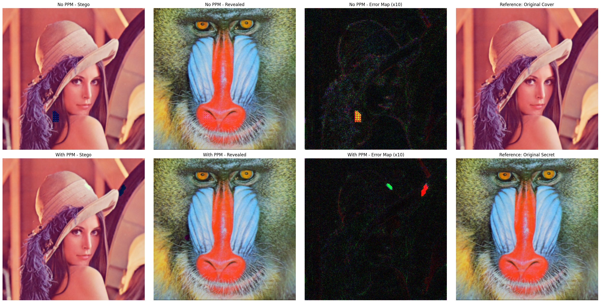
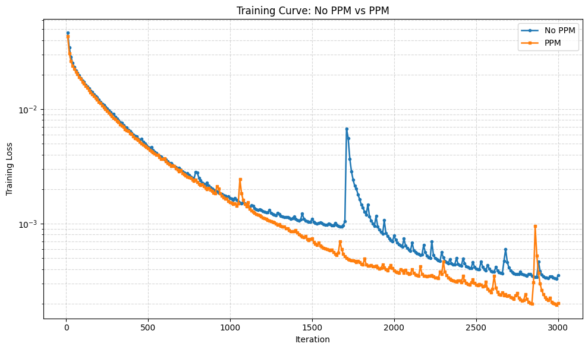

# StegoPNet: Deep Image Steganography via Pyramid Pooling

---

## 📜 Academic Attribution

This implementation and research are directly based on the architecture and methodologies proposed in the following academic publication:

> **"StegoPNet: Image Steganography With Generalization Ability Based on Pyramid Pooling Module"** > **Authors:** X. Duan, K. Jia, B. Li, D. Guo, Z. Zhang, and E. Sun
> **Journal:** IEEE Access, 2020
> **DOI:** [10.1109/ACCESS.2020.3033895](https://doi.org/10.1109/ACCESS.2020.3033895)

All architectural foundations, including the integration of the Pyramid Pooling Module (PPM) for multi-scale feature extraction in steganographic tasks, are attributed to the original authors.

---

## 📌 Project Overview

StegoPNet is an end-to-end deep learning framework designed to hide a full-sized RGB secret image within a cover image of identical dimensions ($256 \times 256$). By leveraging a **Pyramid Pooling Module (PPM)**, the network gains a global understanding of the cover image's structure. This allows the model to embed data more intelligently in areas where changes are less perceptible to the human eye and statistical analysis tools.

---

## 🧬 Key Component: Pyramid Pooling Module (PPM)

Unlike standard CNNs that focus on local pixel neighborhoods, the PPM captures features at multiple scales ($32 \times 32$, $16 \times 16$, $8 \times 8$, $4 \times 4$, and $2 \times 2$). This multi-scale approach is crucial for:

* **Global Context Awareness:** Recognizing large, smooth areas versus high-texture regions.
* **Adaptive Embedding:** Prioritizing edges and complex textures to minimize visual artifacts.

---

## 🧪 Experimental Results (Trial Run)

The following results were obtained from a trial execution conducted in **Google Colab (Tesla T4 GPU)** using the classic **Lena** image as the cover and the **Baboon** image as the secret payload. The models were trained for **3,000 iterations**.

### 1. Visual Performance & Error Analysis

The comparison below highlights the difference in reconstruction quality and embedding strategy between the Baseline (No PPM) and the proposed StegoPNet (With PPM).

* **No PPM:** Shows noticeable visual distortion in the Stego image. The Error Map ($\times 10$) reveals a less organized embedding pattern, leading to easier detection.
* **With PPM:** The Stego image remains visually indistinguishable from the original. The Error Map shows that PPM concentrates modifications in textured areas (like the feathers in Lena's hat), significantly improving **imperceptibility**.

### 2. Training Convergence

The training curve demonstrates the stability and efficiency gain provided by the multi-scale pooling architecture.

* **PPM (Orange Line):** Exhibits a smoother and faster descent. It achieves a significantly lower loss, proving that the PPM helps the network solve the "hiding" and "revealing" tasks more effectively.
* **No PPM (Blue Line):** Displays higher volatility and plateaus at a higher loss value. The sharp spikes suggest that without multi-scale features, the network struggles to find a stable way to hide the high-entropy Baboon data.

---

## 🧮 Mathematical Framework

The total loss of the system is optimized using a weighted Mean Squared Error ($MSE$):

$$Loss = L_{h} + \alpha L_{r}$$

Where:

* $L_{h}$ is the Hiding Loss ($MSE$ between Cover and Stego).
* $L_{r}$ is the Reveal Loss ($MSE$ between Secret and Revealed).
* $\alpha$ is the hyperparameter set to **0.6** to balance the priority between invisibility and reconstruction.

---

## 📁 Repository Structure

* `stegopnet.py`: Contains the `PPMModule`, `HidingNet`, and `RevealNet` classes.
* `train.py`: Main training script utilized for the Colab trial.
* `helpers.py`: Utility functions for metrics like **PSNR** and **SSIM**.

---

*Developed for academic research purposes. Last updated May 2026.*